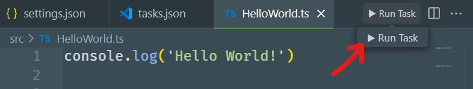
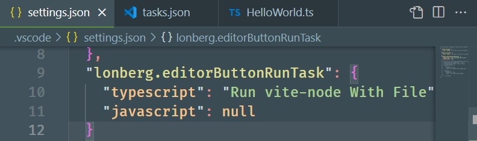

# 🚀 Editor Task Button

Это расширение добавляет кнопку <button style="background: transparent; color: inherit; border-radius: 4px; "> ▶ Run Task </button> запуска задач `.vscode/tasks.json` в заголовок редактора:



Установите расширение и настройте задачи для любого поддерживаемого идентификатора языка:


Скопируйте имя задачи в настройку активации:



Кнопка будет отображаться только в редакторах для указанных языков. Откройте `.vscode/settings.json` и заполните настройки, значением должно быть имя задачи из `tasks.json:tasks[i]:label`:

```json
"lonberg.editorButtonRunTask": {
  "typescript": "Run Node With File", // string | null
  "python": "Py Run File",
  ...
}
```

> 📌 Задача выбирается в зависимости от текущего расширения активного файла редактора.

Поддерживаемые [идентификаторы языка](https://code.visualstudio.com/docs/languages/identifiers#_known-language-identifiers):

```js
[
'plaintext', 'code-text-binary', 'Log', 'log', 'scminput', 'bat', 'clojure', 'coffeescript', 'jsonc', 'json', 'c', 'cpp', 'cuda-cpp', 'csharp', 'css', 'dart', 'diff', 'dockerfile', 'ignore', 'fsharp', 'git-commit', 'git-rebase', 'go', 'groovy', 'handlebars', 'hlsl', 'html', 'ini', 'properties', 'java', 'javascriptreact', 'javascript', 'jsx-tags', 'jsonl', 'snippets', 'julia', 'juliamarkdown', 'tex', 'latex', 'bibtex', 'cpp_embedded_latex', 'markdown_latex_combined', 'less', 'lua', 'makefile', 'markdown', 'markdown-math', 'wat', 'objective-c', 'objective-cpp', 'perl', 'raku', 'php', 'powershell', 'jade', 'python', 'r', 'razor', 'restructuredtext', 'ruby', 'rust', 'scss', 'search-result', 'shaderlab', 'shellscript', 'sql', 'swift', 'typescript', 'typescriptreact', 'vb', 'xml', 'xsl', 'dockercompose', 'yaml', 'raw', 'ssh_config'
]
```
